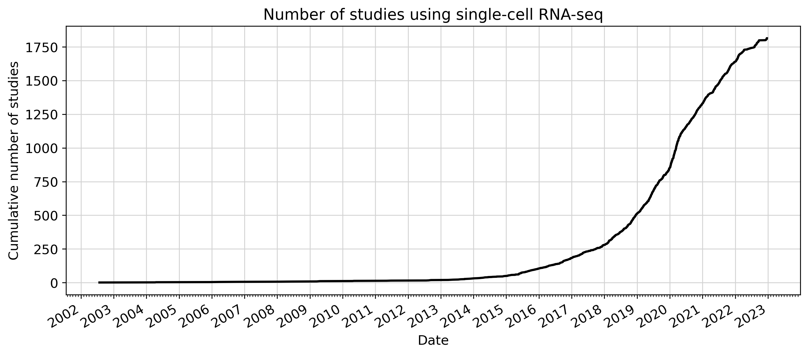
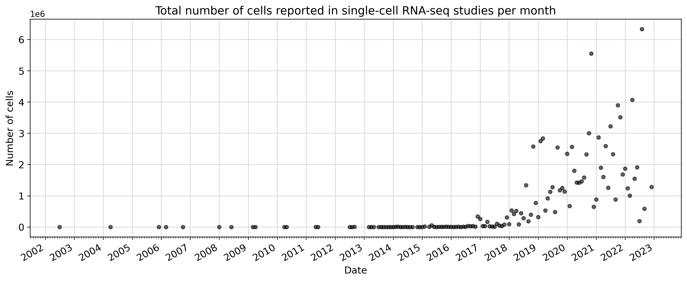
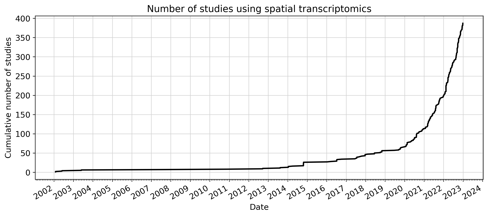
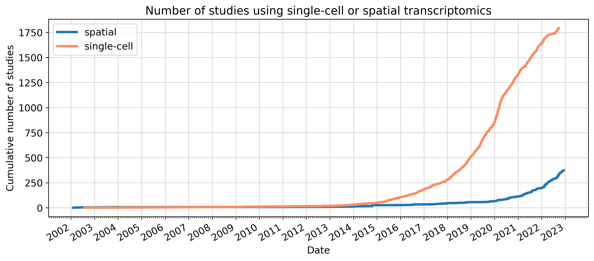
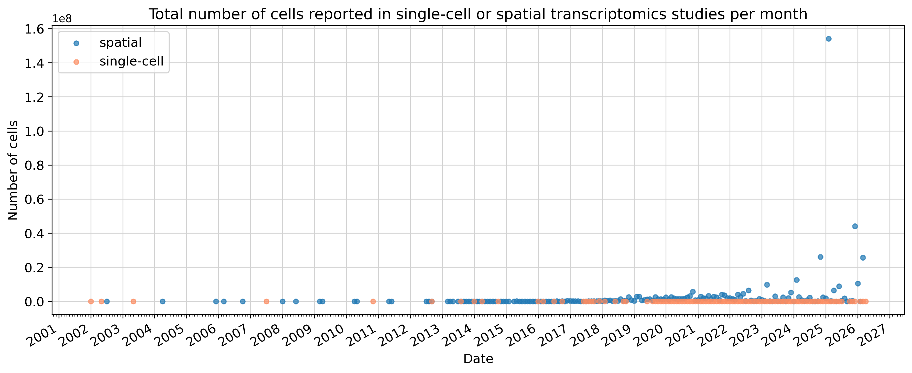

# transcriptomics-studies-over-time

This repository generates plots showing the increase in studies using transcriptomics technologies over time. The plots are automatically updated every week. Please cite the listed data sources.

**1. Single-cell RNA-sequencing**  

**Note**: This plot was [made](https://github.com/pachterlab/kallistobustools/blob/master/docs/tutorials/scRNA-seq_intro/python/scRNA-seq_intro.ipynb) by [@sinabooeshaghi](https://github.com/sbooeshaghi/) as part of the tutorials on the [kallistobus.tools](https://www.kallistobus.tools/) website: https://www.kallistobus.tools/tutorials/scrna-seq_intro/python/scrna-seq_intro/.

Valentine Svensson, Eduardo da Veiga Beltrame, & Lior Pachter Database, Volume 2020, 2020, baaa073; doi: 10.1093/database/baaa073
Also see:  
https://www.nxn.se/single-cell-studies  
https://www.nxn.se/single-cell-studies/gui

 

**2. Spatial transcriptomics**  
Moses, L., Pachter, L. Museum of spatial transcriptomics. Nat Methods 19, 534–546 (2022). https://doi.org/10.1038/s41592-022-01409-2

 

**Combined plots:** 

